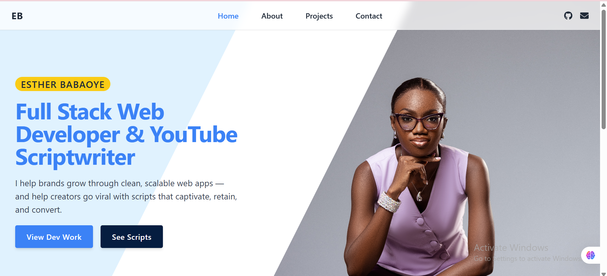

# Esther Babaoye | Portfolio

A modern and responsive portfolio website built with **React, Vite, Tailwind CSS, and Framer Motion**, showcasing my work as a **Full-Stack Developer & YouTube Scriptwriter**.  

---

## 🚀 Live Demo

---

## 📸 Preview
  
*(Replace with your actual screenshot in the `public/` folder)*  

---

## ✨ Features
- ⚡ **Fast & Responsive** — Built with Vite + React + Tailwind CSS  
- 🎨 **Dark/Light Mode Toggle** with device preference support  
- 🖼️ **Animated UI** using Framer Motion  
- 🔍 **SEO Optimized** with meta tags, Open Graph, and structured data  
- 📂 Pages: **Home, About, Projects, Resume, Contact**  
- 📱 Mobile-first design  

---

## 🛠️ Tech Stack
- **Frontend:** React, Vite, Tailwind CSS  
- **Animations:** Framer Motion  
- **Icons:** React Icons  
- **SEO:** React Helmet Async  
- **Deployment:** Netlify  

---

